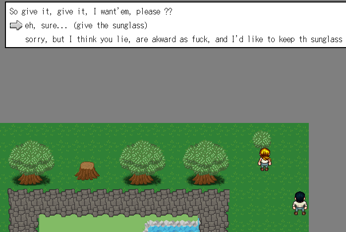
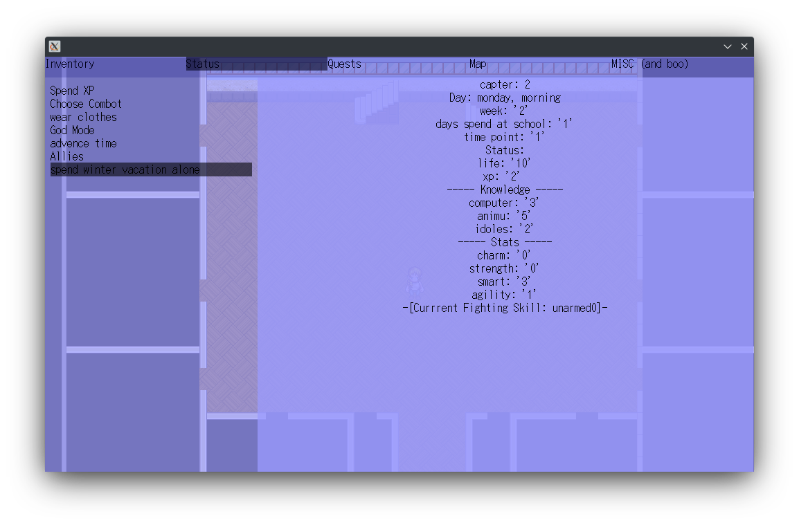

<head>
<link rel="stylesheet" href="styling.css">
</head>

# Sad UwU, while listening to Dallos OST

## 2022 [Sukeban](https://github.com/cosmo-ray/Sukeban) Advent Calendar

I'm gonna try to have one Game improvement per day

### Day 21

Add Mysticall Neet Go-under (the name's a reference to a Game) club, it's an "hiden" club that perform strage ritual.
They HQ is the hiden house, which is ... hiden.

[commit](https://github.com/cosmo-ray/yirl/commit/2667cf0024c496f5022e65c39a615dd85072606d)

### Day 20

Add Random quests from random guys.

[commit](https://github.com/cosmo-ray/yirl/commit/afaed7f0469dd95379f7ac95e37166565a7d56ee)

### Day 19

Add whellball stadium in noitoise

[commit](https://github.com/cosmo-ray/yirl/commit/7742cc42aeef111ea490baba90abb3308d5d4c07)

### Day 18

Add some sunday shoping stuff

[commit](https://github.com/cosmo-ray/yirl/commit/c8e311dcd37a29331931e92d2bd786b57c1e4d6c)

### Day 17

NPCs ai can now go to they club after school

[commit](https://github.com/cosmo-ray/yirl/commit/1543ab49ac8abc6b6bba72554ba978daf216ed6c)

### Day 16

Add news on TV

[commit](https://github.com/cosmo-ray/yirl/commit/4a1cefd0f8355b6a2b7c25a9f77f1e7f99d37d1f)
[commit](https://github.com/cosmo-ray/yirl/commit/eff6828ffa1bf926c6fd360cc0a59b9384315105)

### Day 15

Add a room at school for sport club.

[commit](https://github.com/cosmo-ray/yirl/commit/b141921b85338359e3a44878197e6dace3c4ab84)
[commit](https://github.com/cosmo-ray/yirl/commit/f642ecb318349be1ca6046e0776c86b3ede5d789)

### Day 14

Skate Movement

[commit](https://github.com/cosmo-ray/yirl/commit/66f2df31e7adbb556606c7292226f6f26a6b6bf3)

### Day 13

Add wearable head items

[commit](https://github.com/cosmo-ray/yirl/commit/7c6b874aacf6a79092099790d68c8b5f0bfa28d3)

### Day 12

Enemies now fall on the ground before dieying.

[commit](https://github.com/cosmo-ray/yirl/commit/0547aeed9acef22a0be89bcc7f7be3e14d10df32) (yes the commit is in the engine and not the game for a change :)
Also jrpg-fight yirl module, is by far the wort modules of all, I hate that code, every time I check it I wonder if I should rewrite it, just refacto it, and how....
So yeah don't look it too much :)

### Day 11

A new quest 'bout sunglass,
Also add some stuff in the park

[commit](https://github.com/cosmo-ray/Sukeban/commit/648de4f486b4ece748ecc2d1b97cfd339d113b6f)
[commit](https://github.com/cosmo-ray/Sukeban/commit/66de74118b12dac443dd19c747ef947de9d9ba18)

### Day 10

Add anime generic when you can watch animu, Nyaaaaa !!!! (but no anime are moe, it's /m/en stuff(and fe/m/ale stuff, the gender is not important)

[commit](https://github.com/cosmo-ray/Sukeban/commit/3a0ed0fe18e304decc040f185d0f6edfb2769973)

### Day 9

Ability to slack off whole day.
- It increase lazyness
- skipp day...

Also been lazy now add a new event at school

[commit](https://github.com/cosmo-ray/Sukeban/commit/87057a2d6e2ac659c06c3514ec6a613c8a25a1b2)
[commit](https://github.com/cosmo-ray/Sukeban/commit/c5c1cb552c42f2c07a9a97348619619f61e70598)

### Day 8

More dialogues durring prologue that increase grumpyness and shyness.
No Image 'caus I'm shy. (and lazy, I should add a lazy trait...)

[commit](https://github.com/cosmo-ray/Sukeban/commit/27cf32ccc39b1ad02c394edb33e49f06bf47a4cd)

### Day 7

Add a new school

[commit](https://github.com/cosmo-ray/Sukeban/commit/1344b975438a34b402c116fa460b55a254d91d1f)

### Day 6

Add a city center.

[commit](https://github.com/cosmo-ray/Sukeban/commit/8446adab32c60b7ee3a16f33f631caa5a61849f6)
(maybe there is a rogue changes that spoil next days :p)

### Day 5

[commit](https://github.com/cosmo-ray/Sukeban/commit/b0129a784edf414a2d20760cbdaa018cfdfcfc8f) (not very interesting though, it's only a png modification wth gimp and tiled stuff)

Rounder Edge on Running field

### Day 4

[commit](https://github.com/cosmo-ray/Sukeban/commit/98b6252b7ae22298ff4751420bd551b7d1a773c2)

Add movement mode, with slow mode, when presing ctrl, you are now moving slower.
No image as I don't know which image would ilustarte the chage :p

### Day 3

You can now go from chapter 1 to chapter 3 (the last) without using cheat.

*Chapter 2 and 3 are still mostly empry*

commits [here](https://github.com/cosmo-ray/Sukeban/commit/eedac09901a5404f904c0bc0dc0503e0421a5f59) and [here](https://github.com/cosmo-ray/Sukeban/commit/88f460abd8eb9b7c07f4f008f4d51ce500681c97)

### Day 2

[Add Outside iteraction with environements](https://github.com/cosmo-ray/Sukeban/commit/fbeaeb716953a3d720dd48556dc8d90ff4d9d0ec) <a href="https://github.com/cosmo-ray/Sukeban/commit/0ebf852356796ba5d6c2497892bce7c50006af9b">here too</a> (done with tiled in case you wonder)

### Day 1

[Add name to characters generation](https://github.com/cosmo-ray/Sukeban/commit/b4dba7062016f62fc9fe6572e58add7dfeee2532)

[9 day after](https://github.com/cosmo-ray/Sukeban/commit/3030d8b02d0c7de8bfe65f6444269f3713afdc39)
